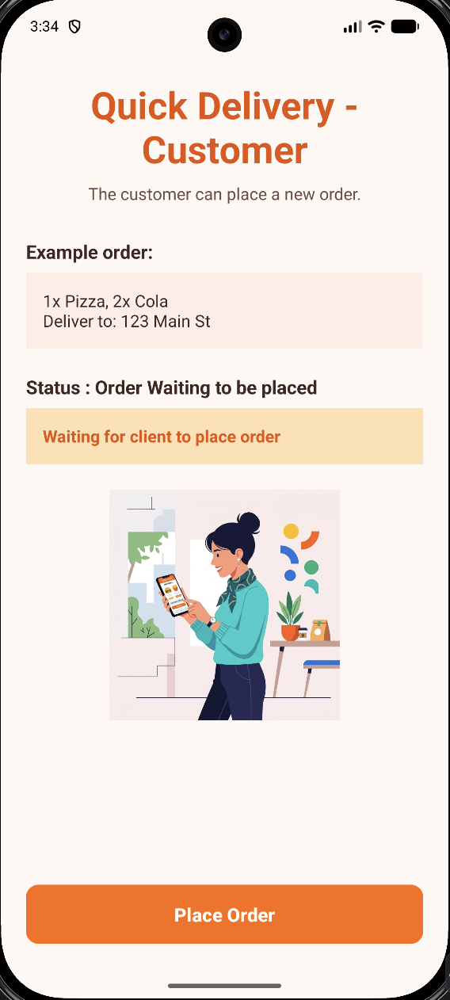
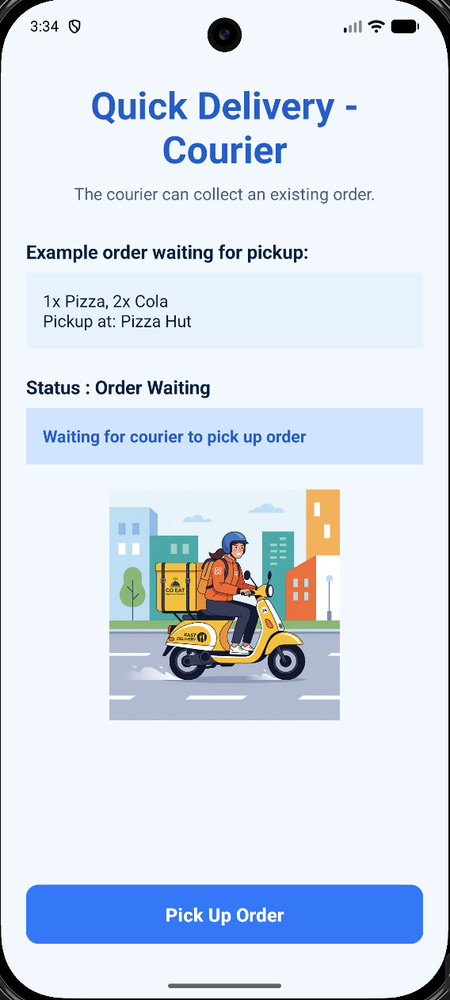

# Quick Delivery Shared App

Welcome to the **Quick Delivery** project! This is a multi-module Android project built using Kotlin that demonstrates sharing code, resources, and UI elements between different applications. The project contains two distinct applications—one for the **Customer** and one for the **Courier**—both utilizing a shared `common` module.

## Project Structure

This repository is organized into three main modules:

*   **`common`**: A shared library module that holds the core functionality and the base UI structure (`MainActivityBase`, base layouts, shared strings, and sounds). This promotes code reusability and ensures a consistent look and feel across both apps.
*   **`client`**: The **Customer app** module. It depends on the `common` module and customizes it to allow the customer to place new delivery orders.
*   **`courier`**: The **Courier app** module. It also depends on the `common` module and customizes it for the courier to pick up and manage existing delivery orders.

## Features

*   **Code Sharing**: Uses a shared base activity (`MainActivityBase`) to handle the shared logic, insets, and click actions.
*   **Resource Sharing**: Both apps use shared colors, dimensions, and base strings from the `common` module, overriding only what is specific to each app.

## Screenshots & Video
For video demonstration check the *docs folder* in the project files.

Here is a look at the two applications built from this single shared codebase:

### Client App
The Customer interface for placing a new order.

### Courier App
The Courier interface for picking up an existing order.

This project is for educational and demonstrative purposes.
